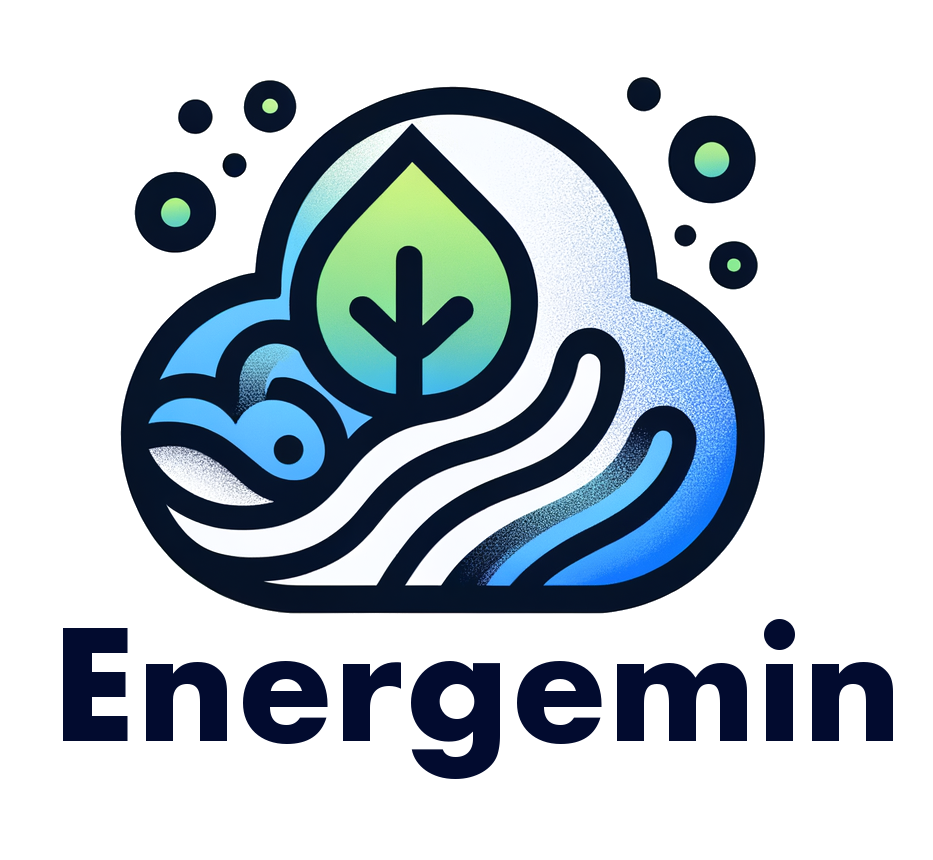

## 📌 Overview

Energemin is a tool to audit machine energy efficiency and provide actionable insights and suggestions to improve its energy efficiency using Gemini LLM.


It analyzes the machine metrics and provides a summary of the energy efficiency of the machine. 
If the machine has an internet connection, it can also provide recommendation based on the location of the machine.

The report indicated tips and advice to improve the energy efficiency of the machine.

## 🚀 Features

- [x] Audit machine energy efficiency using psutil 
- [x] Provide actionable insights and suggestions to improve energy efficiency using Gemini LLM
- [x] Recommendation based on the location of the machine
- [x] Chatbot mode to interact with the user with a conversational memory and API call

## 🎥 Demo

The live action of Energemin with a Mac M1: [Demo Video](https://youtu.be/3g5Kz89mEpg)

## Usage

### ⚙️ Configuration

Environement variable array GCP_PROJECT_ID and GCP_LOCATION_ID are required to be set to interact with Google Cloud Platform and Vertex AI.
| Environment Variable | Description |
| ---------------------- | ----------- |
| GCP_PROJECT_ID | The Google Cloud Project ID to use for Vertex AI. |
| GCP_LOCATION | The Google Cloud Location (example: us-central1) to use for Vertex AI. |
| REPOSITORY | [optional]The Google Cloud Repository ID for the container image in Artifact Registry. |

Simple run the command to start the audit:
```bash
make run
```

Chatbot mode:
```bash
make launch-ui
```

## 💻 Development

```bash
make init
```

```bash
make style
```

## 🛡️ Licence
[Apache License 2.0](https://raw.githubusercontent.com/fvaleye/energemin/main/LICENSE.txt)